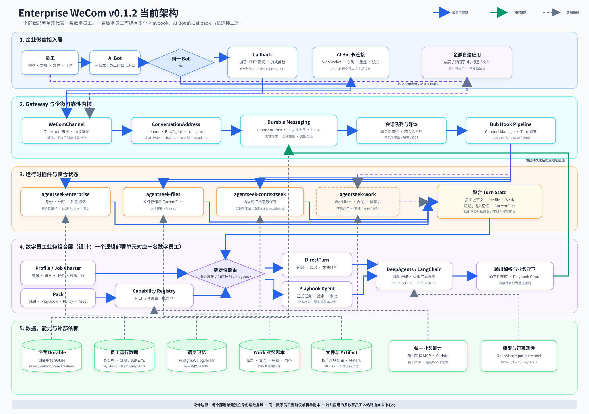

# 数字员工架构、概念与部署边界

> **简要结论：** 一个逻辑部署单元代表一名数字员工。一名数字员工拥有一个
> Profile、一个统一能力池，以及零个或多个同岗位边界内的 Playbook。不同研发
> 团队基于统一脚手架创建独立部署，不把多个数字员工混入同一运行实例。

## 背景

`enterprise-wecom` 同时包含通用运行内核和一个可实例化的数字员工样例。
通用内核负责企微协议、身份、文件、记忆、Work 和生命周期；研发团队负责定义
具体数字员工的岗位、能力、业务流程和部署配置。

这里的“一名数字员工”指一个稳定的业务身份，不是使用企微的人类员工，也不等于
一个 Playbook。它由 `digital_employee_id` 标识，可以同时服务多名人类员工和多个
群聊。



- [查看可缩放 SVG 原图](assets/enterprise-wecom-v0.1.2-architecture.svg)
- [下载 4096 × 2880 PNG 高清图](assets/enterprise-wecom-v0.1.2-architecture-4k.png)

## 核心概念

| 概念 | 含义 | 基数关系 |
| --- | --- | --- |
| 框架与脚手架 | 所有研发团队共享的 AgentSeek、Bub 和 `contrib` 能力 | 一套框架产生多个部署单元 |
| 逻辑部署单元 | 可独立配置、发布、监控和回滚的一名数字员工 | 一个部署单元对应一个 `digital_employee_id` |
| 数字员工 | 稳定的岗位和业务身份，可服务多人、多群和多个正式服务 | 一名数字员工对应一个活动 Profile |
| Profile / Job Charter | 岗位、职责、服务目录和权限上限 | 一个 Profile 可以声明多个服务 |
| Pack | Profile 使用的版本化 Skill、Playbook、Policy 和 Asset 集合 | 一个部署加载一个活动 Pack 版本 |
| Capability Registry | 普通协助与正式流程共享的统一能力池 | 一名数字员工一个有效能力池 |
| Playbook | 有任务、合同、状态机、检查点或审批的正式服务 | 一名数字员工可以有零个或多个 Playbook |
| AI Bot | 员工与该数字员工对话的主要企微入口 | 每个 Bot 在 Callback 与长连接中二选一 |
| 自建应用 | 指定成员、部门、标签和文件的补充通道 | 可以与任一 AI Bot 模式并行启用 |

## 一个部署单元为什么只代表一名数字员工

不同数字员工通常拥有不同的岗位 Owner、组织授权、部门知识、MCP 权限、业务账本
和审批责任。把它们放进同一实例，会扩大一次路由错误或配置错误的影响范围。

因此项目有意采用以下模型：

```text
统一框架与脚手架
├── 团队 A 定制 → 战略发展部数字员工 → 独立部署单元
├── 团队 B 定制 → 信息技术部数字员工 → 独立部署单元
└── 团队 C 定制 → 同部门另一名数字员工 → 独立部署单元
```

“部署单元”比“进程”更准确。当前 v0.1.2 在单机上用一个进程运行一个部署单元；
未来同一名数字员工可以有多个高可用副本，但这些副本仍共享同一个
`digital_employee_id`、Profile、Pack 和一致性边界，不会变成多名数字员工。

当前 [`build_spec()`](src/enterprise_wecom_digital_employee/agent.py#L237)
只构建一套数字员工 Registry 和 Runnable，符合这一产品模型。它没有根据 BotID、
部门或消息内容动态加载另一套 Profile。

## 一名数字员工如何拥有多个 Playbook

Profile 的服务目录和 Pack 的 `playbooks` 都是集合；
[`RoutedAgentRunnable`](src/enterprise_wecom_digital_employee/agent.py#L128)
也会为 Registry 中的每个 `playbook_ref` 构建绑定后的 Agent。因此，多 Playbook
是当前架构已经支持的能力，不需要创建多数字员工运行时。

```text
一名数字员工
├── 一个 Profile / Job Charter
├── 一个统一 Capability Registry
└── 零个或多个正式 Playbook
    ├── Playbook A
    ├── Playbook B
    └── Playbook C
```

同一数字员工内的 Playbook 必须满足以下共同边界：

- 属于同一岗位职责和业务 Owner；
- 服从同一个 Profile 权限上限；
- 复用同一个有效能力池，不复制另一套 MCP 或文件系统；
- 使用唯一 `playbook_ref`、明确路由词和确定性优先级；
- 各自保留 WorkItem、合同、状态机、审批和版本；
- 路由有歧义时请求员工澄清，已有任务时优先续接当前绑定。

如果两个服务的部门身份、数据授权、审批责任或岗位使命不同，就应拆成两名数字员工，
即使它们由同一个研发团队维护。

## Transport 与业务身份保持分离

[`WeComChannel`](../../contrib/agentseek-wecom/src/agentseek_wecom/channel.py#L167)
为一个部署单元选择 Callback 或长连接作为 AI Bot 主通道，并允许挂载补充的自建
应用 Transport。BotID 和 AgentID 是渠道身份，`digital_employee_id` 才是业务身份。

```text
AI Bot ── Callback 或长连接 ──> 数字员工
                                   |
公共自建应用 ── 主动通知/文件 ────+
```

更换 Bot、切换 Transport 或迁移企微应用，不应改变数字员工的业务身份，也不应让
历史 WorkItem 失联。

公共自建应用可以成为多个数字员工的主动出站出口，但每条消息必须携带明确来源、
业务幂等键和目标可见范围。公共应用的入站回调只有一个入口；当前项目尚未提供把该
入口动态分发给多名数字员工的中心路由器。因此 v0.1.2 不允许多个部署实例同时消费
同一个公共应用回调。

## 会话、记忆与数据隔离

[`ConversationAddress`](../../contrib/agentseek-wecom/src/agentseek_wecom/addressing.py#L16)
统一保存 tenant、Bot/Agent、Transport、会话、发送人和回复期限。群聊 session 包含
BotID 和 chatid；兼容性单聊 session 仍使用 `wecom:<userid>`。

这意味着独立部署不能只依赖单聊 session 字符串实现跨数字员工隔离。在存储主键尚未
全面纳入 `digital_employee_id` 前，每个部署单元必须使用独立数据库、schema、表前缀
或物理存储路径。尤其不能让两名数字员工直接共用当前短期记忆表。

目标逻辑作用域是：

```text
tenant_id
+ digital_employee_id
+ conversation_id
```

多个部署可以共用 PostgreSQL 集群、对象存储或模型服务，但必须保持以下逻辑边界：

| 数据 | 隔离要求 |
| --- | --- |
| 企微 inbox/outbox | 独立 durable 路径；同一数字员工多副本前需共享且支持分布式 lease |
| 短期记忆 | 独立 schema/表/数据库，或主键显式包含 `digital_employee_id` |
| 语义记忆 | 使用独立 backend/table，或由 tenant、数字员工、员工和群会话共同限定检索域 |
| 显式长期记忆 | 使用独立 Store，或由 tenant、数字员工和员工共同限定 namespace |
| Work 业务账本 | 所有任务保留 `digital_employee_id`、Profile 和 PackSnapshot |
| 文件与 Artifact | 按 tenant、数字员工、员工、会话或 WorkItem 组织 |
| 日志与审计 | 独立服务标识、发布版本和受限目录，不记录凭据及签名 URL |

短期和语义记忆只能帮助理解上下文，不能证明授权或业务动作已经完成。正式任务、合同、
审批、发布和交付状态以 Work 业务账本为权威来源。

## 研发团队与框架维护者的责任

| 责任方 | 主要维护内容 | 不应自行分叉的内容 |
| --- | --- | --- |
| 框架维护者 | AgentSeek 生命周期、Bub 插件合同、企微 Transport、通用身份/记忆/文件/Work 内核 | 某个部门的岗位规则和专属流程 |
| 数字员工研发团队 | Profile、Pack、Skill、Playbook、Capability 映射、业务测试和部门知识 | 在项目内复制并长期修改通用 Transport 或 durable 内核 |
| 运维团队 | `.env`、凭据、端口、存储、进程、健康检查、日志、备份和回滚 | 把主机配置或真实密钥提交到仓库 |
| 应用与数据 Owner | 自建应用可见范围、MCP 权限、知识数据和审批责任 | 用展示名称代替稳定技术 ID 做授权 |

各团队可以独立发布数字员工，但应持续从统一框架 GA 升级公共内核。业务差异通过稳定
扩展点表达，不通过复制 `contrib` 源码形成长期私有分支。

## 每个部署单元必须明确的内容

- 唯一且稳定的 `digital_employee_id`、Profile 版本和 Pack 版本；
- 独立 AI Bot，以及 Callback/长连接二选一的主通道；
- 是否启用公共自建应用，以及允许的业务来源和目标范围；
- 独立端口、运行目录、durable、记忆、Work、文件和审计边界；
- 部门知识、MCP、模型与外部检索的真实授权；
- 进程管理、健康检查、备份、凭据轮换和回滚点；
- 单聊、多员工、双群、媒体、重启恢复和敏感信息扫描的验收结果。

## v0.1.2 的当前边界

v0.1.2 已验证一个部署单元、一个进程、一名数字员工的单主机运行。以下能力尚未交付：

- 同一逻辑数字员工的多主机、多副本协调；
- 多数字员工共用一个 Gateway 并动态选择 Profile；
- 公共自建应用入站消息的多数字员工中心路由；
- 不做逻辑隔离而直接共用当前短期或显式长期记忆表。

这些边界不妨碍一个部门部署多名数字员工，也不妨碍一名数字员工拥有多个 Playbook。
它们要求每名数字员工保持独立的业务身份和部署边界。

## 相关文档

- [企业数字员工框架研发指南](DEVELOPER_GUIDE.md)
- [快速部署与创建企业数字员工](DEVELOPER_QUICKSTART.md)
- [扩展数字员工的 Skill、MCP 和 Playbook](EXTENDING_DIGITAL_EMPLOYEE.md)
- [数字员工研发分支、验证与合并流程](DEVELOPMENT_WORKFLOW.md)
- [v0.1.2 生产冻结](PRODUCTION_FREEZE.md)
- [后续演进路线](ROADMAP.md)
